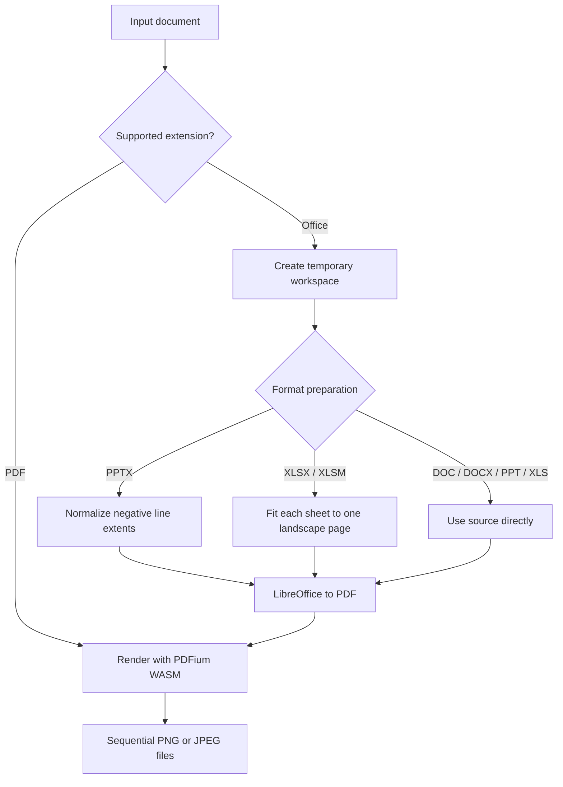

# Design

## Purpose

`document-image-renderer` converts PDF, DOC, DOCX, PPT, PPTX, XLS, XLSX, and XLSM documents into ordered PNG or JPEG images. The public Go API lives in `pkg/renderer`; the executable is isolated under `cmd` and its command implementation under `internal`.

## Repository layout

```text
cmd/document-image-renderer/  command entry point
internal/cli/                 command argument and output handling
pkg/renderer/                 public API and rendering implementation
test/documents/               source document fixtures
test/integration/             end-to-end format tests
tmp/document_image_renderer/  read-only Python reference implementation
```

The Go module neither imports nor reads from `tmp/document_image_renderer` at build time or runtime.

## Pipeline



PDFium is embedded as WebAssembly and run by wazero. PDF rendering therefore has no operating-system package dependency and does not require CGO. Each render owns and closes its PDFium pool so WebAssembly memory is released after the operation.

LibreOffice remains an external process because reliable Office layout is not available in a general-purpose Go package. It is invoked with an argument array, never through a shell. Every conversion gets an isolated user profile with macro security set to Very High.

## Format preparation

- DOC, DOCX, and PPT are passed directly to LibreOffice.
- PPTX slide XML is copied and negative line extents are normalized.
- XLS uses the Calc `SinglePageSheets` PDF export option.
- XLSX and XLSM worksheet XML is copied and configured with `fitToPage`, width 1, height 1, and landscape orientation.
- Malformed OOXML preprocessing falls back to the original input so LibreOffice reports the conversion failure.

Temporary Office copies, profiles, and intermediate PDFs are removed after rendering. XLSM macros are not executed.

## Errors and cancellation

Public error types distinguish unsupported formats, missing LibreOffice, Office conversion failures, and PDF rendering failures. Conversion failures retain LibreOffice standard output and standard error. `context.Context` cancellation stops LibreOffice and is checked between PDF pages.

## Resource limits

PDFium WebAssembly uses 32-bit linear memory. A single RGBA bitmap requires four bytes per pixel and must fit alongside PDFium document state. Callers processing untrusted input should enforce request deadlines and external CPU, memory, output-size, and storage limits.

Office rendering depends on LibreOffice version, installed fonts, and locale. Pixel-for-pixel equivalence with Microsoft Office is not guaranteed.
