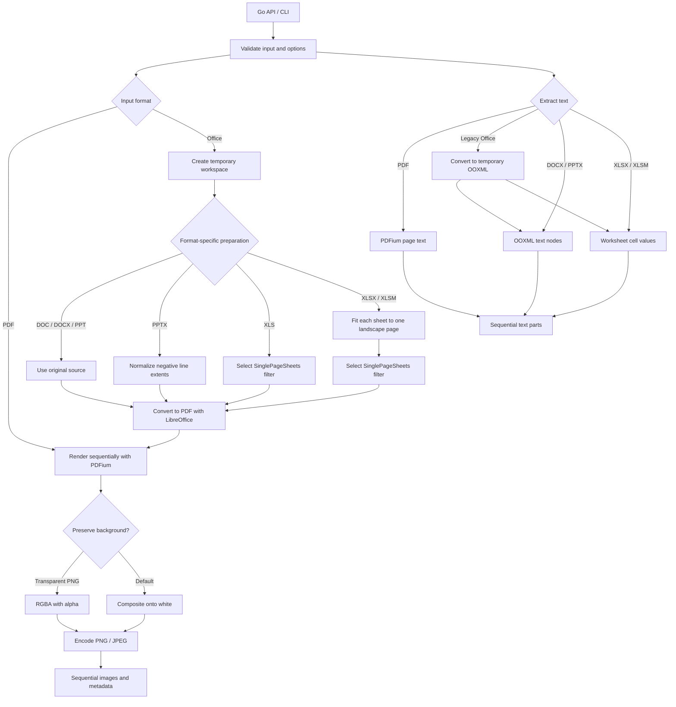

# document-image-renderer Design

## Purpose

`document-image-renderer` is a Go library and command-line tool that converts PDF and Microsoft Office documents into page-oriented PNG or JPEG images. Its Go API also extracts document text in source order.

The public API lives in `pkg/renderer`. CLI-specific argument parsing and output handling are isolated in `internal/cli`. PDF rasterization uses PDFium compiled to WebAssembly, while Microsoft Office documents are converted to PDF with LibreOffice.

## Scope

| Input family | Extensions | Render unit | Text extraction unit |
|---|---|---|---|
| PDF | `.pdf` | Page | Page |
| Word | `.doc`, `.docx` | Page | Document body |
| PowerPoint | `.ppt`, `.pptx` | Slide | Slide |
| Excel | `.xls`, `.xlsx`, `.xlsm` | Printed worksheet page | Worksheet |

The output formats are lossless PNG and quality-configurable JPEG. XLS, XLSX, and XLSM use LibreOffice's `SinglePageSheets` PDF export option so that each worksheet produces one PDF page and therefore one image. XLSX and XLSM also apply matching page settings to a temporary copy.

The actual output unit and order follow the pages fixed in the intermediate PDF. Print settings that this library does not explicitly modify, including hidden worksheets, print areas, and margins, follow LibreOffice's PDF export behavior.

The following features are out of scope:

- Password entry and decryption for encrypted documents
- Repair of corrupted documents
- Execution of Office macros
- Document editing or structural analysis beyond ordered text extraction
- Pixel-for-pixel equivalence with Microsoft Office in arbitrary environments

## Reproducibility

In this library, reproduction means rendering every page in the intermediate PDF at the requested resolution and in the original order, without omission, when the same PDFium version, LibreOffice version, fonts, locale, and rendering options are used.

LibreOffice, rather than Microsoft Office, determines the layout of Office documents. Differences in rendering engines, font metrics, font substitution, supported features, and LibreOffice versions can change pagination, shape placement, and image pixels. Environments that require stable output must pin the conversion tool versions and locale and install the fonts referenced by source documents.

## Architecture



The conversion pipeline has three stages:

1. Validate the input, output destination, and options, and prepare a temporary copy when required for an Office document.
2. Convert an Office document to PDF with a process-specific LibreOffice profile. PDF input skips this stage.
3. Render every PDF page sequentially with PDFium and save it as PNG or JPEG.

Using PDF as the intermediate representation fixes page dimensions, text, shapes, images, and placement without reimplementing the page layout of each Office format in Go.

## Public API

The public Go API is provided by `pkg/renderer`. It renders supported documents, extracts their text, and counts rendered pages. All entry points accept paths rather than streams; input paths and returned artifact paths are absolute.

The primary rendering API is used as follows:

```go
options := renderer.DefaultRenderOptions()
options.DPI = 200
options.ImageFormat = renderer.ImageFormatPNG

result, err := renderer.RenderDocument(
	context.Background(),
	"samplefile.docx",
	"output",
	&options,
)
if err != nil {
	return err
}
for _, image := range result.Images {
	fmt.Println(image.PageNumber, image.Path, image.Width, image.Height)
}
```

Use `DefaultRenderOptions` or `DefaultExtractOptions` before overriding individual fields. Passing `nil` selects the corresponding defaults. A non-`nil` options value is validated as supplied and is not merged with defaults.

## API Reference

### Supported formats

`SupportedExtensions() []string` returns the accepted lowercase extensions in lexical order: `.doc`, `.docx`, `.pdf`, `.ppt`, `.pptx`, `.xls`, `.xlsm`, and `.xlsx`. All document entry points match extensions case-insensitively.

### Render document

```go
func RenderDocument(ctx context.Context, source, outputDirectory string, options *RenderOptions) (*RenderResult, error)
```

`RenderDocument` creates `outputDirectory` when needed and renders each page of the source document in order. `RenderResult.Source` is the absolute input path; every `RenderedImage.Path` is an absolute output path. For Office input, LibreOffice produces a temporary PDF before rendering. The function returns no result on failure, but images written before a later failure remain in the output directory.

### Page count
```go
func PageCount(ctx context.Context, source string) (int, error)
func PageCountWithOptions(ctx context.Context, source string, options *ExtractOptions) (int, error)
```

`PageCount` returns the number of pages that `RenderDocument` would render without writing images. For Office input it converts to a temporary PDF. `PageCountWithOptions` controls the LibreOffice executable and timeout used for that conversion; `PageCount` uses `DefaultExtractOptions`.

### Text extraction

```go
func ExtractDocument(ctx context.Context, source string) (*ExtractResult, error)
func ExtractDocumentWithOptions(ctx context.Context, source string, options *ExtractOptions) (*ExtractResult, error)
```

These functions extract ordered text without writing files. PDF parts correspond to pages, PPT/PPTX parts to slides, and XLS/XLSX/XLSM parts to worksheets. DOC and DOCX return the document body as one part because OOXML does not define rendered page boundaries. Legacy DOC, PPT, and XLS files are converted to temporary OOXML with LibreOffice before extraction. `ExtractDocument` uses `DefaultExtractOptions`.

### Options

```go
func DefaultRenderOptions() RenderOptions
func (RenderOptions) Validate() error
func DefaultExtractOptions() ExtractOptions
func (ExtractOptions) Validate() error
```

| `RenderOptions` field | Default | Constraint and meaning |
|---|---:|---|
| `DPI` | `300` | Rendering resolution from 1 through 1200 DPI |
| `MaxPages` | `0` | Maximum pages to render; `0` permits unlimited pages |
| `ImageFormat` | `ImageFormatPNG` | PNG or JPEG output encoding |
| `JPEGQuality` | `90` | Value from 1 through 100; validated even for PNG output |
| `TransparentBackground` | `false` | Preserve PDF page alpha for PNG output |
| `FilenamePrefix` | Source basename without extension | Empty selects the source stem; a non-empty value must be one filename component |
| `LibreOfficeTimeout` | `120s` | Timeout for one Office conversion; `0` permits no timeout |
| `LibreOfficeExecutable` | Auto-detected | Explicit LibreOffice executable when provided |

`ImageFormat` is a string type with the only valid values `ImageFormatPNG` (`"png"`) and `ImageFormatJPEG` (`"jpeg"`).

JPEG has no alpha channel, so combining `ImageFormatJPEG` with `TransparentBackground=true` is invalid.

| `ExtractOptions` field | Default | Constraint and meaning |
|---|---:|---|
| `MaxCharacters` | `0` | Maximum Unicode characters across all extracted parts; `0` permits unlimited text |
| `LibreOfficeTimeout` | `120s` | Timeout for a legacy Office conversion; `0` permits no timeout |
| `LibreOfficeExecutable` | Auto-detected | Explicit LibreOffice executable when provided |

. Modern OOXML extraction does not invoke LibreOffice, though options are validated before routing.

### Results

```go
type RenderedImage struct {
  PageNumber int
  Path       string
  Width      int
  Height     int
}

type RenderResult struct {
  Source string
  Images []RenderedImage
}

func (RenderResult) PageCount() int

type TextPart struct {
  PartNumber int
  Text       string
}

type ExtractResult struct {
  Source string
  Parts  []TextPart
}

func (ExtractResult) PartCount() int
func (ExtractResult) Part(number int) (TextPart, bool)
func (ExtractResult) Text() string
```

`RenderedImage` values are in PDF page order and have one-based `PageNumber` values. `RenderResult.PageCount` returns `len(Images)`. `TextPart` values are in source order and have one-based `PartNumber` values. `ExtractResult.Part` returns the part with the requested number; `Text` joins all parts with one blank line.

### Errors

Callers can use `errors.As` for the following public error types:

| Error type | Condition |
|---|---|
| `UnsupportedFormatError` | Unsupported input extension |
| `DependencyNotFoundError` | LibreOffice cannot be resolved for an operation that requires it |
| `PageLimitExceededError` | The document page count exceeds `RenderOptions.MaxPages` |
| `CharacterLimitExceededError` | Extracted text exceeds `ExtractOptions.MaxCharacters` |
| `DocumentConversionError` | Office conversion or temporary conversion setup fails; includes `Path`, `Stdout`, `Stderr`, and an unwrapped cause |
| `DocumentPageCountError` | PDF page counting fails; includes `Path` and an unwrapped cause |
| `DocumentRenderError` | PDF rasterization or image writing fails; includes `Path` and an unwrapped cause |
| `DocumentExtractionError` | Text extraction or text-limit validation fails; includes `Path` and an unwrapped cause |

Invalid options, a `nil` context, invalid input paths, and output-directory creation failures are ordinary errors with operation context rather than the public document-processing error types.

## Input Validation and Routing

The rendering and extraction entry points share document validation. They perform the following checks before starting an external tool:

1. The `context.Context` is not `nil`.
2. Every option satisfies its constraints.
3. The input path can be made absolute and identifies an existing regular file.
4. The lowercased extension is in the supported set.
5. For rendering, the output path can be made absolute and its directory can be created.

PDF input proceeds directly to rasterization. Every other supported format proceeds through Office conversion, then sends the intermediate PDF through the same PDF rendering path. The library does not infer formats from file contents.

## Office Conversion

### Executable resolution

When `LibreOfficeExecutable` is set, its value is used directly. Otherwise, the library searches `PATH` for `libreoffice` and then `soffice`. If neither is found, only Office input fails with `DependencyNotFoundError`. PDF input does not require LibreOffice.

### Temporary workspace

Each Office conversion creates an independent workspace under the operating system's temporary directory.

```text
document-image-renderer-*/
  profile/                 Dedicated LibreOffice user profile
  output/                  Intermediate PDF or OOXML document
  <temporary-office-file>  Prepared OOXML, when required
```

LibreOffice receives `-env:UserInstallation=file:...`. This prevents contention for the default profile lock and keeps user-specific settings out of the conversion path. The profile configures macro security level 3, Very High.

After a successful conversion, the workspace is removed when rendering or extraction finishes. On failure, it is removed as soon as the failure is established. The source file is never modified.

### LibreOffice invocation

LibreOffice is invoked with an argument array rather than through a shell. The command includes `--headless`, `--nologo`, `--nodefault`, `--nolockcheck`, and `--nofirststartwizard`. Standard output and standard error are captured for diagnostics.

The invocation derives a context with the `LibreOfficeTimeout` deadline from the parent context. `exec.CommandContext` stops the process when that deadline expires or the parent context is canceled. A successful process exit is still considered a conversion failure unless a regular target file with the expected name was produced.

### Format-specific preparation

| Format | Preparation | Rationale |
|---|---|---|
| DOC, DOCX | None | Pass directly to LibreOffice without introducing an unnecessary intermediate format |
| PPT | None | Avoid additional presentation layout changes |
| PPTX | Normalize negative width and height values for line shapes | Reduce line reversal caused by differences in how PowerPoint and LibreOffice interpret negative extents |
| XLS | Set `SinglePageSheets=true` in the Calc PDF export filter | Fit each sheet to one page without rewriting the binary format |
| XLSX, XLSM | Apply the same `SinglePageSheets` filter; also set `fitToPage=1`, `fitToWidth=1`, `fitToHeight=1`, and landscape orientation on every worksheet, and remove `scale` | Ensure each worksheet produces exactly one PDF page while keeping explicit page settings in the temporary OOXML copy |

PPTX normalization applies only to preset shapes whose type is `line`. For each axis with a negative extent, it adds that extent to the offset and replaces the extent with its absolute value. This normalizes the representation while preserving the endpoints. When no target is changed, the original source is used directly.

XLSX and XLSM settings are applied to `xl/worksheets/sheet*.xml`. Missing `sheetPr`, `pageSetUpPr`, and `pageSetup` elements are added while respecting the relevant OOXML element ordering.

If OOXML ZIP processing or XML parsing fails, the preprocessing error is not exposed separately. Instead, the original source is passed to LibreOffice so that the actual layout engine determines whether conversion is possible and provides the final diagnostic. Rewriting reconstructs ZIP members in a temporary file and never writes back to the source.

## PDF Rendering

PDF rendering uses the `go-pdfium` WebAssembly backend running on wazero. It therefore requires neither CGO, an operating-system PDF package, nor an external PDF renderer process.

Each PDF rendering or extraction call initializes a dedicated PDFium pool with a minimum and maximum of one instance. Rendering and extraction share the same internal PDF lifecycle helper. The complete PDF is read into memory, opened by PDFium, and queried for its page count. The pool, instance, and document are always closed when the call ends.

Pages are processed sequentially from the zero-based PDFium index and exposed as one-based page numbers. Context cancellation is checked between pages. Pages are not rendered concurrently, which keeps output order and the number of live page bitmaps predictable.

### Background handling

- Default rendering uses PDFium's DPI rendering API with form rendering enabled, then composites the result onto an opaque white background.
- Transparent PNG rendering creates an alpha-enabled PDFium bitmap, initializes it as transparent, and renders annotations into it. The WASM buffer is copied into a Go byte slice so that the Go image remains valid after the PDFium bitmap is destroyed.

Transparency is accepted only for PNG output. Encoding uses the Go standard library's `image/png` and `image/jpeg` packages.

## Output Contract

The output directory is created with mode `0755` when necessary. Output names use the following forms:

```text
<prefix>-page-<page-number>.png
<prefix>-page-<page-number>.jpg
```

Page numbers are zero-padded to at least four digits. For a document with 10,000 or more pages, the width expands to the number of digits in the total page count. This keeps lexical filename order aligned with page order.

`os.Create` replaces files with generated names that already exist. Unrelated files and stale numbered files beyond the page count of the current conversion are not removed.

Output is not transactional. If rendering, encoding, saving, or cancellation fails on a later page, images already written for earlier pages remain in place. No `RenderResult` is returned on error. A caller that must expose only complete results should render into a dedicated temporary output directory and move it after success.

For XLS, XLSX, and XLSM input, each exported worksheet corresponds to exactly one PDF page and one output image, in workbook order.

## Error Model

Public error types correspond to processing boundaries so callers can distinguish causes with `errors.As` and `errors.Is`.

| Error type | Condition | Diagnostic data |
|---|---|---|
| `UnsupportedFormatError` | The input extension is unsupported | Extension and absolute input path |
| `DependencyNotFoundError` | LibreOffice cannot be resolved for Office input | Dependency name and required operation |
| `PageLimitExceededError` | The rendered page count exceeds `RenderOptions.MaxPages` | Actual page count and configured limit |
| `CharacterLimitExceededError` | Extracted text exceeds `ExtractOptions.MaxCharacters` | Actual Unicode character count and configured limit |
| `DocumentConversionError` | Temporary workspace setup, LibreOffice execution, timeout, or missing conversion output fails | Input path, underlying cause, and LibreOffice standard output and standard error |
| `DocumentPageCountError` | PDF page counting fails | Input path and underlying cause |
| `DocumentRenderError` | PDF reading, PDFium initialization, document opening, page rendering, image saving, or cancellation during rendering fails | PDF path, operation including the page number when applicable, and underlying cause |
| `DocumentExtractionError` | PDF, OOXML, or workbook text extraction, including character-limit validation, fails | Input path and underlying cause |

`DocumentConversionError`, `DocumentPageCountError`, `DocumentRenderError`, and `DocumentExtractionError` implement `Unwrap`. Invalid options, a `nil` context, a missing input, a non-regular input, path resolution failures, and output directory creation failures are returned as ordinary errors with operation context rather than being wrapped in these public types.

For Office input, a rendering error references the temporary PDF path. `RenderResult.Source` always references the original absolute input path.

## Cancellation, Concurrency, and Resource Management

The `context.Context` is passed to LibreOffice process execution and PDFium instance acquisition and is checked between PDF pages. It does not interrupt a single page render or Go image encoding after that operation has begun.

Each call owns an independent LibreOffice profile and PDFium pool, so separate calls can run concurrently when they use different output destinations. The library does not coordinate calls that share the same output directory and prefix, and it does not guarantee the result of concurrent writes to the same filename.

The complete PDF byte stream is held in memory. During rendering, at least the PDFium-side and Go-side page bitmaps are also present; opaque rendering additionally allocates the white compositing image. An RGBA bitmap requires approximately four bytes per pixel. PDFium WebAssembly uses 32-bit linear memory, so high DPI values or very large pages can reach its memory limit.

The library does not impose default limits on page count, expanded document size, total pixel count, or total output size. Callers can set `RenderOptions.MaxPages`; services that process untrusted documents must also enforce process-level CPU, memory, file-size, storage, and concurrency limits in addition to context deadlines.

## Security

- LibreOffice is launched without a shell, so an input path is not interpreted as part of a command string.
- Each Office conversion uses an isolated user profile with macro security set to Very High. XLSM macros are not executed.
- OOXML modifications and LibreOffice output are restricted to the dedicated temporary workspace, and the source file is not modified.
- The library is not itself a sandbox. Protection from malicious documents parsed by PDFium or LibreOffice depends on current dependency versions and isolation supplied by the execution environment.

## CLI Design

`cmd/document-image-renderer` creates a context that handles operating-system signals and delegates to `internal/cli.Run`. The CLI exposes the library options as flags and accepts `SOURCE OUTPUT_DIRECTORY` as positional arguments.

On success, each generated image path is followed by the path of its UTF-8 text file. A text file uses the same stem as its image, replacing the image extension with `.txt`. The CLI matches `RenderedImage.PageNumber` to `TextPart.PartNumber`; when no corresponding part exists, it writes an empty text file. This occurs for additional DOC or DOCX pages because those formats expose one document-body text part rather than rendered page boundaries. Paths are emitted only after rendering, extraction, and all text writes succeed. Diagnostics and usage information are written to standard error. Exit codes have the following meanings:

| Exit code | Meaning |
|---:|---|
| `0` | Conversion succeeded, or help was displayed |
| `1` | Rendering, extraction, or text output failed |
| `2` | Flag parsing failed or positional arguments were invalid |

The CLI contains no document conversion or extraction logic. It delegates to `renderer.RenderDocument` and `renderer.ExtractDocumentWithOptions`, then writes one text artifact for each rendered image.

## Package Structure

```text
cmd/
  document-image-renderer/
    main.go                 Process startup, signals, and exit code
internal/
  cli/
    cli.go                  Argument parsing and standard I/O
pkg/
  renderer/
    doc.go                  Public package documentation
    models.go               Options and result models
    errors.go               Public error types
    renderer.go             Shared validation and rendering pipeline control
    extract.go              Extraction API and format routing
    office.go               LibreOffice execution and temporary workspace
    ooxml.go                PPTX/XLSX/XLSM preparation
    ooxml_text.go           DOCX/PPTX text extraction
    workbook_text.go        XLSX/XLSM cell extraction
    pdf.go                  Shared PDFium lifecycle, rendering, and extraction
test/
  documents/                Document fixtures
  integration/              Integration tests using real tools
example/                    Public API example
```

The primary direct dependencies are `go-pdfium` for PDF rendering and extraction, `etree` for XML editing, and `excelize` for workbook text extraction. The PDFium WASM backend depends on wazero through `go-pdfium`. LibreOffice is a system dependency for Office rendering and legacy DOC, PPT, or XLS extraction, not a Go module dependency.

The `vllm-file-gateway` project under `temp/` is a read-only integration reference. This module neither imports nor reads it at build time or runtime.

## Testing Strategy

### Unit tests

Tests under `pkg/renderer` verify the following behavior:

- Every PDF page is rendered in order, and sequential filenames and dimension metadata match the actual image files.
- JPEG, custom prefixes, and transparent PNG output follow their options.
- Unsupported extensions return the corresponding public error type.
- LibreOffice discovery, isolated profiles, macro security configuration, and the XLS export filter are correct.
- LibreOffice standard output and standard error are retained on conversion errors.
- Negative PPTX line extents and the XLSX/XLSM one-page landscape settings are rewritten correctly.
- PDF, OOXML, workbook, and legacy Office extraction preserve source order.
- Option validation, text joining, result models, and CLI exit codes satisfy the public contract.

LibreOffice discovery and execution are replaceable at small function boundaries, allowing unit tests to avoid an external process. Actual PDFium rendering is exercised with a small PDF fixture.

### Integration tests

When `RUN_INTEGRATION_TESTS=1`, integration tests dynamically collect every file directly under `test/documents`. For each document, they verify that at least one image and one text part are generated, every image can be opened by a Go image decoder, dimensions are positive and match the metadata, and the SHA-256 hash of the source file does not change.

Office cases are skipped when LibreOffice is unavailable. `make verify` runs the standard checks, while `make test-integration` includes real Office conversion.

Pixel-level regressions can be detected by comparing perceptual hashes or image differences against reference images in an environment with fixed PDFium, LibreOffice, fonts, and locale. Tool updates can produce legitimate layout differences, so reference images should be updated only after visual review.