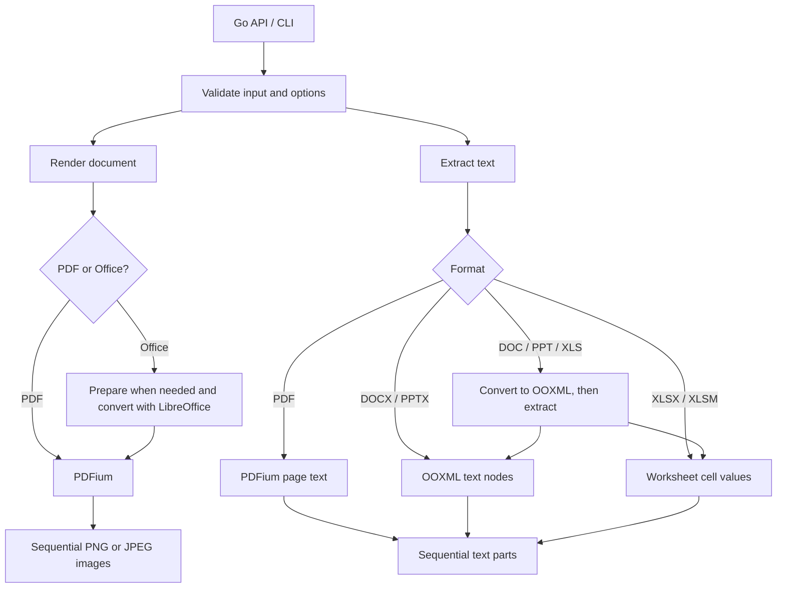

# document-image-renderer Design
`document-image-renderer` is a Go library and command-line tool that renders PDF and Microsoft Office documents as page-oriented PNG or JPEG images, and extracts their text in source order. The public API is `pkg/renderer`; the CLI is isolated in `internal/cli`. Rendering uses PDFium compiled to WebAssembly, while Office documents are converted with LibreOffice.

## Scope

| Input family | Extensions | Render unit | Text extraction unit |
|---|---|---|---|
| PDF | `.pdf` | Page | Page |
| Word | `.doc`, `.docx` | Page | Document body |
| PowerPoint | `.ppt`, `.pptx` | Slide | Slide |
| Excel | `.xls`, `.xlsx`, `.xlsm` | Printed worksheet page | Worksheet |

The output formats are lossless PNG and quality-configurable JPEG. XLS, XLSX, and XLSM use LibreOffice's `SinglePageSheets` PDF export option so that each worksheet produces one PDF page and therefore one image. For XLSX and XLSM, matching page settings are applied to a temporary copy. The intermediate PDF fixes the actual output order and unit; other print settings, such as hidden worksheets, print areas, and margins, follow LibreOffice's behavior.

The following features are out of scope:

- Password entry and decryption for encrypted documents
- Repair of corrupted documents
- Execution of Office macros
- Document editing or structural analysis beyond ordered text extraction
- Pixel-for-pixel equivalence with Microsoft Office in arbitrary environments

## Reproducibility

Reproducible output requires fixed PDFium and LibreOffice versions, fonts, locale, and rendering options. LibreOffice, not Microsoft Office, determines Office layout; differences in rendering engines, font substitution, and LibreOffice versions can change pagination and pixels.

## Architecture


```mermaid
flowchart TD
  caller[Go API / CLI] --> validate[Validate input and options]
  validate --> render[Render document]
  validate --> extract[Extract text]
  render --> renderRoute{PDF or Office?}
  renderRoute -->|PDF| pdfium[PDFium]
  renderRoute -->|Office| officePDF[Prepare when needed and convert with LibreOffice]
  officePDF --> pdfium
  pdfium --> image[Sequential PNG or JPEG images]
  extract --> extractRoute{Format}
  extractRoute -->|PDF| pdfText[PDFium page text]
  extractRoute -->|DOCX / PPTX| xmlText[OOXML text nodes]
  extractRoute -->|XLSX / XLSM| workbookText[Worksheet cell values]
  extractRoute -->|DOC / PPT / XLS| legacy[Convert to OOXML, then extract]
  legacy --> xmlText
  legacy --> workbookText
  pdfText --> textParts[Sequential text parts]
  xmlText --> textParts
  workbookText --> textParts
```

For rendering, Office input is converted to a temporary PDF and PDF input is used directly. PDFium then processes pages sequentially and writes one image per page. Text extraction uses the source format where possible; legacy binary Office files are first converted to OOXML. PDF is the rendering intermediate representation, so the library does not reimplement Office layout.

## Packages

| Package | Responsibility |
| --- | --- |
| `cmd/document-image-renderer` | Process startup, signal handling, and exit status |
| `internal/cli` | Flag parsing, standard I/O, and CLI exit codes |
| `pkg/renderer` | Public API, validation, Office conversion, PDF rendering, and text extraction |
| `test/integration` | End-to-end tests using document fixtures and installed dependencies |

## Public API

The public Go API is provided by `pkg/renderer`. It renders supported documents, extracts their text, and counts rendered pages. All entry points accept paths rather than streams; input paths and returned artifact paths are absolute.

The primary rendering API is used as follows:

```go
options := renderer.DefaultRenderOptions()
options.DPI = 300
options.ImageFormat = renderer.ImageFormatPNG

result, err := renderer.RenderDocument(
	context.Background(),
	"samplefile.docx",
	"output",
	&options,
)
if err != nil {
	return err
}
for _, image := range result.Images {
	fmt.Println(image.PageNumber, image.Path, image.Width, image.Height)
}
```

Use `DefaultRenderOptions` or `DefaultExtractOptions` before overriding individual fields. Passing `nil` selects the corresponding defaults. A non-`nil` options value is validated as supplied and is not merged with defaults.

## API Reference

### Supported formats

`SupportedExtensions() []string` returns the accepted lowercase extensions in lexical order: `.doc`, `.docx`, `.pdf`, `.ppt`, `.pptx`, `.xls`, `.xlsm`, and `.xlsx`. All document entry points match extensions case-insensitively.

### Render document

```go
func RenderDocument(ctx context.Context, source, outputDirectory string, options *RenderOptions) (*RenderResult, error)
```

`RenderDocument` creates `outputDirectory` when needed and renders each page in order. Office input is converted to a temporary PDF first. It returns no result on failure, but images written before a later failure remain in the output directory.

### Page count
```go
func PageCount(ctx context.Context, source string) (int, error)
func PageCountWithOptions(ctx context.Context, source string, options *ExtractOptions) (int, error)
```

`PageCount` returns the number of pages that `RenderDocument` would render without writing images. `PageCountWithOptions` controls the LibreOffice executable and timeout; `PageCount` uses `DefaultExtractOptions`.

### Text extraction

```go
func ExtractDocument(ctx context.Context, source string) (*ExtractResult, error)
func ExtractDocumentWithOptions(ctx context.Context, source string, options *ExtractOptions) (*ExtractResult, error)
```

These functions extract ordered text without writing files. PDF parts correspond to pages, presentations to slides, and workbooks to worksheets. DOC and DOCX return one document-body part. Legacy DOC, PPT, and XLS files are converted to temporary OOXML before extraction. `ExtractDocument` uses `DefaultExtractOptions`.

### Options

```go
func DefaultRenderOptions() RenderOptions
func (RenderOptions) Validate() error
func DefaultExtractOptions() ExtractOptions
func (ExtractOptions) Validate() error
```

| `RenderOptions` field | Default | Constraint and meaning |
|---|---:|---|
| `DPI` | `300` | Rendering resolution from 1 through 1200 DPI |
| `RenderTimeout` | `120s` | Timeout for the complete render operation; `0` permits no timeout |
| `LibreOfficeTimeout` | `120s` | Timeout for one Office conversion; `0` permits no timeout |
| `MaxPages` | `0` | Maximum pages to render; `0` permits unlimited pages |
| `MaxPDFBytes` | `134217728` | Maximum PDF input bytes; `0` permits unlimited bytes |
| `MaxPageWidth` | `20000` | Maximum rendered page width; `0` permits unlimited width |
| `MaxPageHeight` | `20000` | Maximum rendered page height; `0` permits unlimited height |
| `MaxPagePixels` | `200000000` | Maximum pixels per page; `0` permits unlimited pixels |
| `MaxDocumentPixels` | `1000000000` | Maximum pixels across the document; `0` permits unlimited pixels |
| `MaxOOXMLMembers` | `10000` | Maximum OOXML ZIP members; `0` permits unlimited members |
| `MaxOOXMLMemberBytes` | `268435456` | Maximum uncompressed bytes per member; `0` permits unlimited bytes |
| `MaxOOXMLTotalBytes` | `1073741824` | Maximum total uncompressed bytes; `0` permits unlimited bytes |
| `ImageFormat` | `ImageFormatPNG` | PNG or JPEG output encoding |
| `JPEGQuality` | `100` | Value from 1 through 100; validated even for PNG output |
| `TransparentBackground` | `false` | Preserve PDF page alpha for PNG output |
| `FilenamePrefix` | Source basename without extension | Empty selects the source stem; a non-empty value must be one filename component |
| `LibreOfficeExecutable` | Auto-detected | Explicit LibreOffice executable when provided |

`ImageFormat` is a string type with the only valid values `ImageFormatPNG` (`"png"`) and `ImageFormatJPEG` (`"jpeg"`).

JPEG has no alpha channel, so combining `ImageFormatJPEG` with `TransparentBackground=true` is invalid.

| `ExtractOptions` field | Default | Constraint and meaning |
|---|---:|---|
| `MaxCharacters` | `0` | Maximum Unicode characters across all extracted parts; `0` permits unlimited text |
| `MaxPDFBytes` | `134217728` | Maximum PDF bytes for page counting or extraction; `0` permits unlimited bytes |
| `MaxOOXMLMembers` | `10000` | Maximum OOXML ZIP members; `0` permits unlimited members |
| `MaxOOXMLMemberBytes` | `268435456` | Maximum uncompressed bytes per member; `0` permits unlimited bytes |
| `MaxOOXMLTotalBytes` | `1073741824` | Maximum total uncompressed bytes; `0` permits unlimited bytes |
| `LibreOfficeTimeout` | `120s` | Timeout for a legacy Office conversion; `0` permits no timeout |
| `LibreOfficeExecutable` | Auto-detected | Explicit LibreOffice executable when provided |

Modern OOXML extraction does not invoke LibreOffice, though options are validated before routing.

### Results

```go
type RenderedImage struct {
  PageNumber int
  Path       string
  Width      int
  Height     int
}

type RenderResult struct {
  Source string
  Images []RenderedImage
}

func (RenderResult) PageCount() int

type TextPart struct {
  PartNumber int
  Text       string
}

type ExtractResult struct {
  Source string
  Parts  []TextPart
}

func (ExtractResult) PartCount() int
func (ExtractResult) Part(number int) (TextPart, bool)
func (ExtractResult) Text() string
```

Image and text parts are ordered and numbered from one. `RenderResult.PageCount` returns `len(Images)`; `ExtractResult.Part` looks up a part by number; `Text` joins parts with one blank line.


### Cancellation, Concurrency, and Resource Management

`RenderTimeout` limits the complete render operation; an earlier caller deadline wins. Calls own independent LibreOffice profiles and PDFium pools, and may run concurrently unless they write the same output name. PDFs and live page bitmaps are held in memory; services processing untrusted input should also enforce process-level CPU, memory, input-size, storage, and concurrency limits.

DOCX and PPTX extraction preserves paragraph boundaries, explicit breaks, and tabs. PPTX slide order follows presentation relationships; hidden slides are included and orphan slide parts are ignored.

### Errors

The error types correspond to processing boundaries and can be inspected with `errors.As` and `errors.Is`.

| Error type | Condition |
|---|---|
| `UnsupportedFormatError` | Unsupported input extension |
| `DependencyNotFoundError` | LibreOffice cannot be resolved for an operation that requires it |
| `PageLimitExceededError` | The document page count exceeds `RenderOptions.MaxPages` |
| `PageSizeLimitExceededError` | A rendered page exceeds a dimension or per-page pixel limit |
| `DocumentPixelLimitExceededError` | Rendered pages exceed the total pixel limit |
| `PDFSizeLimitExceededError` | PDF input exceeds the configured byte limit |
| `CharacterLimitExceededError` | Extracted text exceeds `ExtractOptions.MaxCharacters` |
| `OOXMLLimitExceededError` | OOXML member count or expanded byte limits are exceeded |
| `DocumentConversionError` | Office conversion or temporary conversion setup fails; includes `Path`, `Stdout`, `Stderr`, and an unwrapped cause |
| `DocumentPageCountError` | PDF page counting fails; includes `Path` and an unwrapped cause |
| `DocumentRenderError` | PDF rasterization or image writing fails; includes `Path` and an unwrapped cause |
| `DocumentExtractionError` | Text extraction or text-limit validation fails; includes `Path` and an unwrapped cause |

Invalid options, a `nil` context, invalid input paths, and output-directory creation failures are ordinary contextual errors. Formats are selected by lowercased filename extension; file content is not inspected.


## Office Conversion

### Workspace and invocation

`LibreOfficeExecutable` is used directly when set; otherwise the library searches `PATH` for `libreoffice`, then `soffice`. Each conversion owns a temporary workspace, isolated LibreOffice profile, and prepared OOXML copy when needed. LibreOffice runs without a shell with macro security set to Very High, and the source is never modified. Conversion fails unless the expected regular output exists; standard output and standard error are retained for diagnostics.

### Format-specific preparation

| Format | Preparation | Rationale |
|---|---|---|
| DOC, DOCX | None | Pass directly to LibreOffice without introducing an unnecessary intermediate format |
| PPT | None | Avoid additional presentation layout changes |
| PPTX | Normalize negative width and height values for line shapes | Reduce line reversal caused by differences in how PowerPoint and LibreOffice interpret negative extents |
| XLS | Set `SinglePageSheets=true` in the Calc PDF export filter | Fit each sheet to one page without rewriting the binary format |
| XLSX, XLSM | Apply the same `SinglePageSheets` filter; also set `fitToPage=1`, `fitToWidth=1`, `fitToHeight=1`, and landscape orientation on every worksheet, and remove `scale` | Ensure each worksheet produces exactly one PDF page while keeping explicit page settings in the temporary OOXML copy |

PPTX normalization preserves line endpoints; when no shape changes, the original source is used. XLSX and XLSM settings are applied to `xl/worksheets/sheet*.xml`. OOXML member and expanded-byte limits are enforced both from ZIP metadata and while reading members, and rewriting always targets a temporary file.

## PDF Rendering

PDF rendering uses `go-pdfium` on wazero, requiring neither CGO nor an external renderer. Each call owns a single-instance pool and holds the PDF in memory, bounded by `MaxPDFBytes`. Pages are rendered sequentially; page dimensions and pixel limits are checked before bitmap creation. Cancellation kills the active PDFium instance and waits for it to terminate.

### Background handling

Default rendering composites onto white. Transparent output is PNG-only and uses an alpha bitmap. Images are written to a temporary destination file and renamed after a complete encode, so failed or canceled encodes do not publish a partial file.

## Output Contract

The output directory is created with mode `0755` when necessary. Output names are:

```text
<prefix>-page-<page-number>.png
<prefix>-page-<page-number>.jpg
```

Page numbers are padded to at least four digits and expand for 10,000 or more pages. Existing generated names are replaced, but unrelated and stale files are retained. Output is not transactional: earlier images remain after a later failure. Excel output has one image per exported worksheet in workbook order.

## Security

- **No shell invocation**: LibreOffice runs via `exec.CommandContext` with an argument array, so paths and arguments cannot inject shell commands.
- **Isolated LibreOffice profile**: each conversion uses a fresh temporary profile (`-env:UserInstallation`) with `--headless` and related flags; macro security is Very High (`MacroSecurityLevel=3`), so XLSM macros are not executed.
- **Source documents are never modified**: OOXML preparation runs on temporary copies in the per-conversion workspace; the original file is only read.
- **Temporary workspace permissions**: workspace and output directories are `0700`, the profile file is `0600`, and the workspace is removed after each conversion.
- **Resource limits with overflow-safe arithmetic**: `MaxPDFBytes`, `MaxPages`, page dimension/pixel limits, `MaxOOXML*`, and `MaxCharacters` bound memory, rendering, and text. OOXML limits are enforced from ZIP metadata and while streaming members, mitigating zip-bomb-style archives.
- **Cancellation and timeouts**: context cancellation terminates LibreOffice and interrupts PDFium; `RenderTimeout` and `LibreOfficeTimeout` bound operation duration.
- **Atomic image publication**: images are encoded to a temporary file and renamed only after a complete encode, so failed or canceled encodes never publish a partial image.
- **Filename prefix validation**: `FilenamePrefix` must be a single path component, preventing path traversal through generated output names.
- **The library is not a sandbox**: PDFium (WASM) and LibreOffice run on the host. Malicious documents can exploit vulnerabilities in PDFium, wazero, LibreOffice, or the OOXML libraries; keep dependencies current and run in an isolated host environment.
- **Enforce process-level limits**: services processing untrusted input should also enforce CPU, memory, input-size, storage, and concurrency limits; the library's limits are defense in depth, not a complete boundary.
- **Formats are selected by extension only**: file content is not inspected, so a mislabeled file is processed according to its extension.
- **Output is not transactional**: images written before a later failure remain in the output directory; callers needing all-or-nothing output must stage and publish themselves.
- **Existing output files are replaced**: generated names are overwritten, but unrelated and stale files are retained; use a dedicated output directory.
- **Concurrent writes to the same output name are not coordinated**: callers must avoid concurrent writes to the same filename.
- **Reproducibility depends on the environment**: LibreOffice, not Microsoft Office, determines Office layout; fixed PDFium/LibreOffice versions, fonts, and locale are required for reproducible output.

## CLI Design

`cmd/document-image-renderer` creates a context that handles operating-system signals and delegates to `internal/cli.Run`. The CLI exposes the library options as flags and accepts `SOURCE OUTPUT_DIRECTORY` as positional arguments. `--render-timeout` limits the complete render operation, while `--timeout` retains its existing meaning as the limit for each LibreOffice conversion; both default to 120 seconds.

On success, each generated image path is followed by the path of its UTF-8 text file. A text file uses the same stem as its image, replacing the image extension with `.txt`. The CLI matches `RenderedImage.PageNumber` to `TextPart.PartNumber`; when no corresponding part exists, it writes an empty text file. This occurs for additional DOC or DOCX pages because those formats expose one document-body text part rather than rendered page boundaries. Paths are emitted only after rendering, extraction, and all text writes succeed. Diagnostics and usage information are written to standard error. Exit codes have the following meanings:

| Exit code | Meaning |
|---:|---|
| `0` | Conversion succeeded, or help was displayed |
| `1` | Rendering, extraction, or text output failed |
| `2` | Flag parsing failed or positional arguments were invalid |

The CLI contains no document conversion or extraction logic. It delegates to `renderer.RenderDocument` and `renderer.ExtractDocumentWithOptions`, then writes one text artifact for each rendered image.
